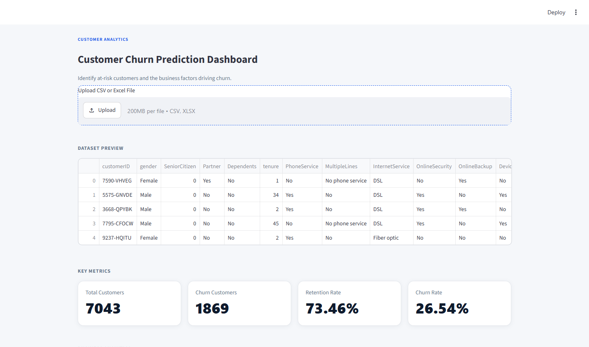
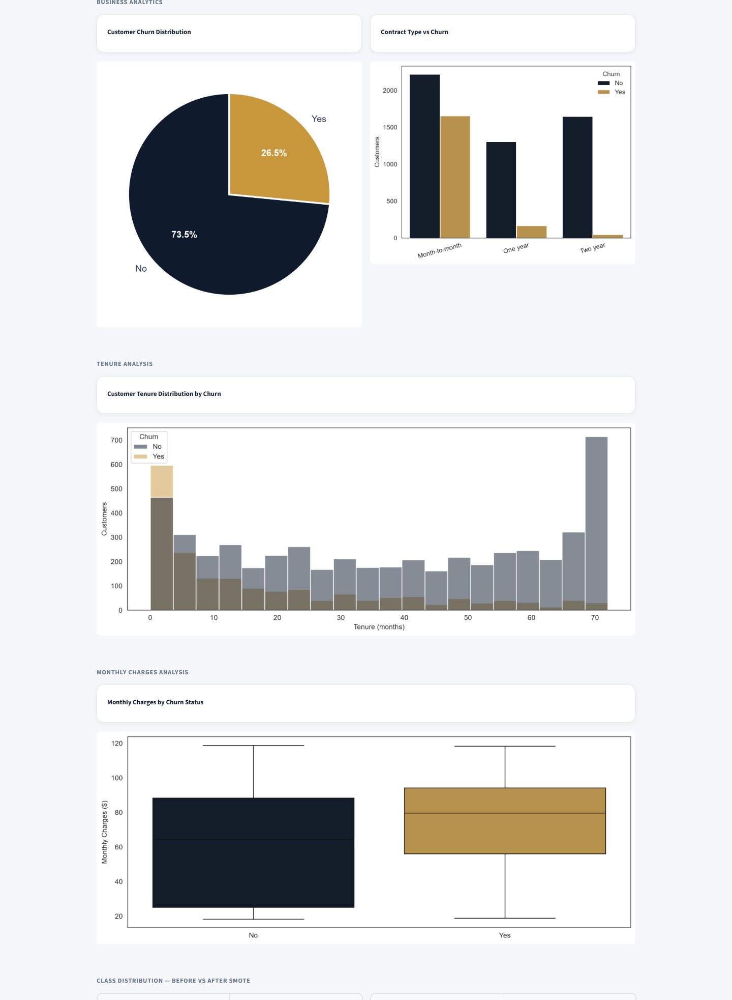
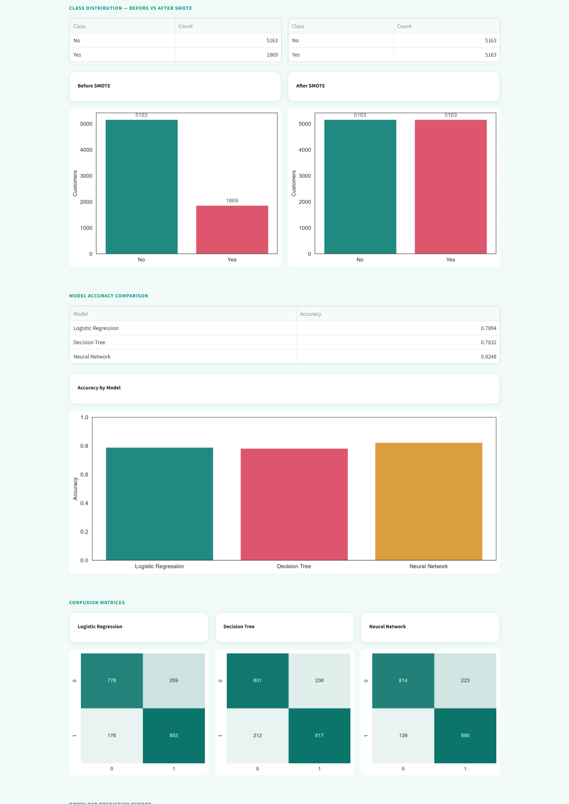

# Customer Churn Prediction

Predicts which telecom customers are likely to leave, and wraps the whole
pipeline in a Streamlit dashboard — upload customer data, see the business
picture, and compare three classifiers side by side.

**[Live demo](https://customer-churn-prediction-7hwogoiapr8qrykx5tn4ed.streamlit.app/)** ·
Python · Scikit-learn · imbalanced-learn · Streamlit

> Built during my Data Science internship at Codec Technologies (May – June 2025).

## The problem

Keeping an existing customer is cheaper than winning a new one, but churners
are a minority of any customer base. A model trained naively on that data
learns to predict "stays" for almost everyone. The goal here is to spot the
customers at risk while handling that class imbalance properly.

## Approach

```
CSV/Excel ─► clean & encode ─► scale ─► SMOTE ─► train/test split ─► LR · Decision Tree · MLP ─► Excel report
```

1. **Preprocessing** — missing-value handling, categorical encoding and feature scaling
2. **Class balancing** — SMOTE oversampling to even out churned vs. retained customers
3. **Modelling** — Logistic Regression, Decision Tree and a Neural Network (MLP), each evaluated with accuracy and a confusion matrix
4. **Reporting** — per-customer churn prediction and probability, exportable to Excel

## Features

- **Upload your own CSV/Excel**, or explore the bundled Telco dataset
- **KPI cards** — total customers, churned customers, retention rate, churn rate
- **Business analytics** — churn distribution, contract type vs. churn, tenure analysis, monthly charges vs. churn
- **Before/after SMOTE** class distribution
- **Model comparison** with confusion matrices for all three models
- **Excel export** of predictions

## Screenshots

| Dashboard overview |
| --- |
|  |

| Business analytics |
| --- |
|  |

| SMOTE balancing, model comparison & confusion matrices |
| --- |
|  |

## Tech stack

| Area | Tools |
|---|---|
| Data | Pandas, NumPy |
| Modelling | Scikit-learn, imbalanced-learn (SMOTE) |
| Visualisation | Matplotlib, Seaborn |
| App & export | Streamlit, openpyxl / XlsxWriter |

## Run it locally

```bash
git clone https://github.com/SobhanaAishwarya/Customer-Churn-Prediction.git
cd Customer-Churn-Prediction
pip install -r requirements.txt
streamlit run app.py
```

Leave the uploader empty to use the bundled dataset.

## Dataset

`Telco_Customer_Churn.csv` (also provided as `Dataset_CCP.csv`) — customer
records with tenure, contract type, monthly/total charges, payment method and
a Yes/No churn label.

## Repository layout

| File | Purpose |
|---|---|
| `app.py` | Streamlit dashboard — the full pipeline runs on each upload |
| `customer_churn_prediction.ipynb` | Exploratory notebook version of the analysis |
| `customer_churn_prediction.pdf` | Notebook exported as a report |
| `Telco_Customer_Churn.csv` / `Dataset_CCP.csv` | Default dataset |

## Possible next steps

- Resample with SMOTE on the training split only, so synthetic samples never reach the test set
- Add precision, recall and ROC-AUC alongside accuracy — they say more on imbalanced data
- Try gradient-boosted models and cross-validated hyperparameter tuning
- Explain individual predictions (e.g. feature importance or SHAP) so retention teams know *why* a customer is at risk
